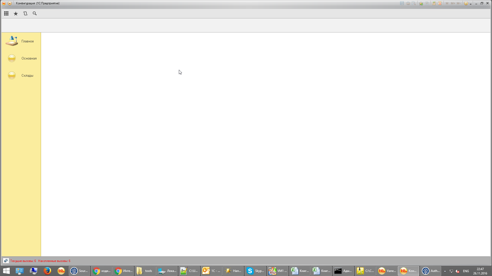
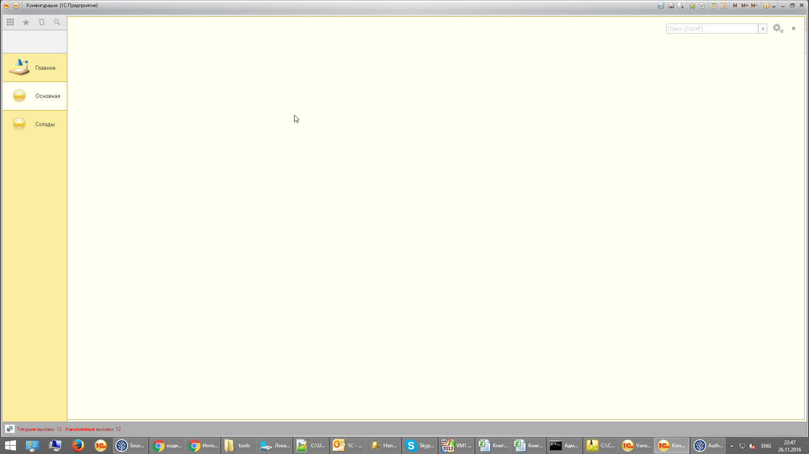
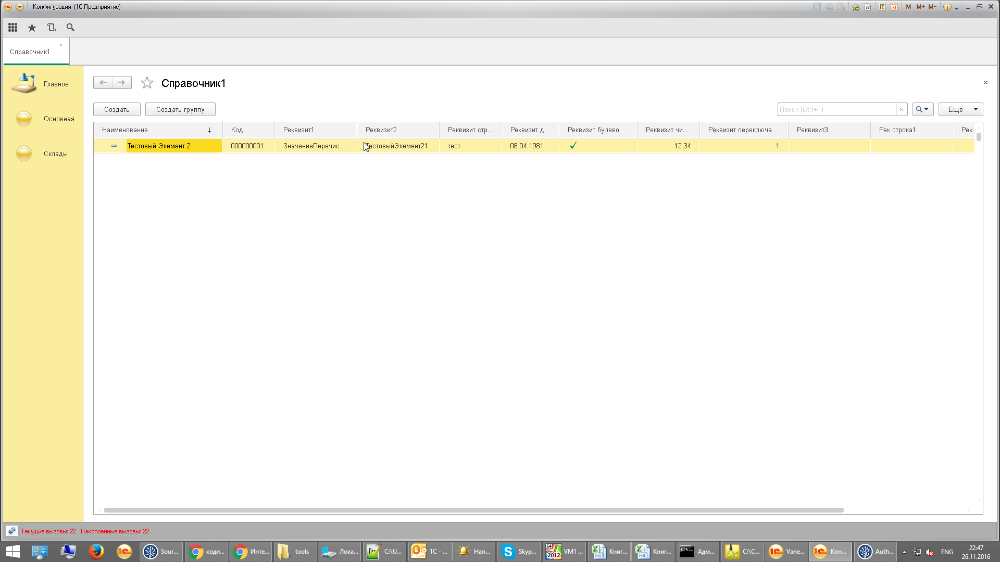
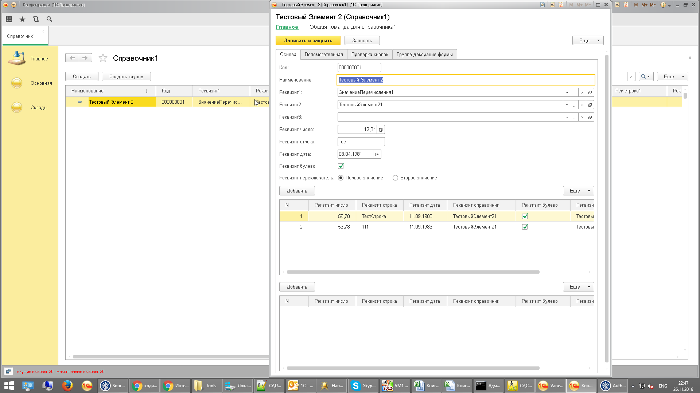
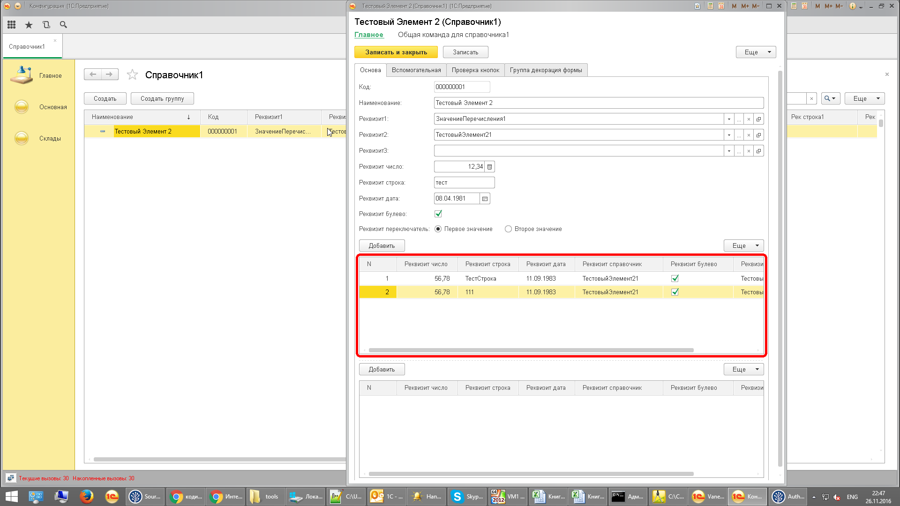
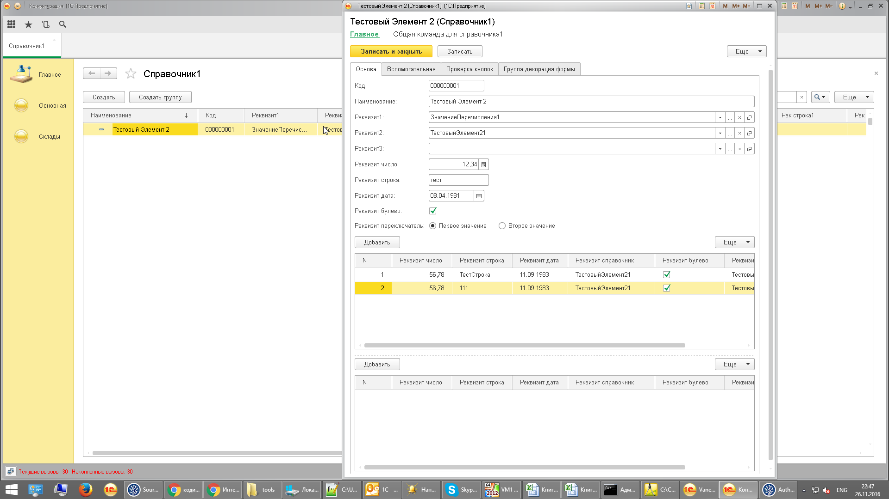
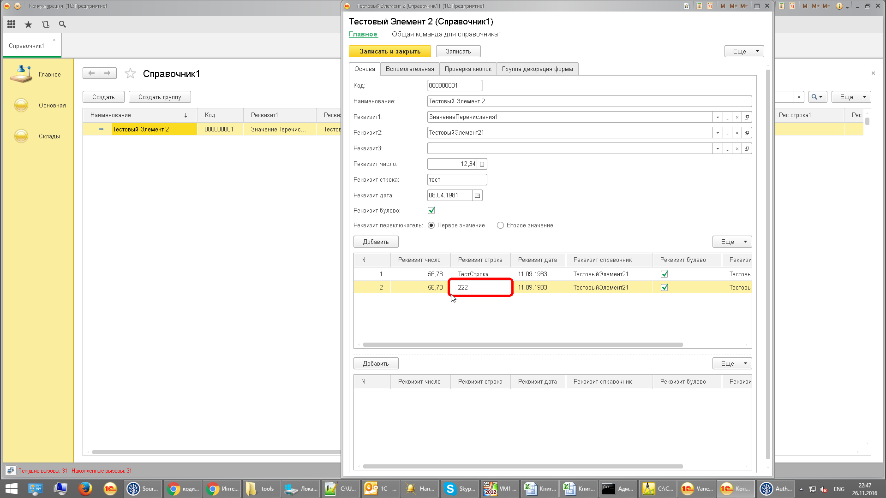
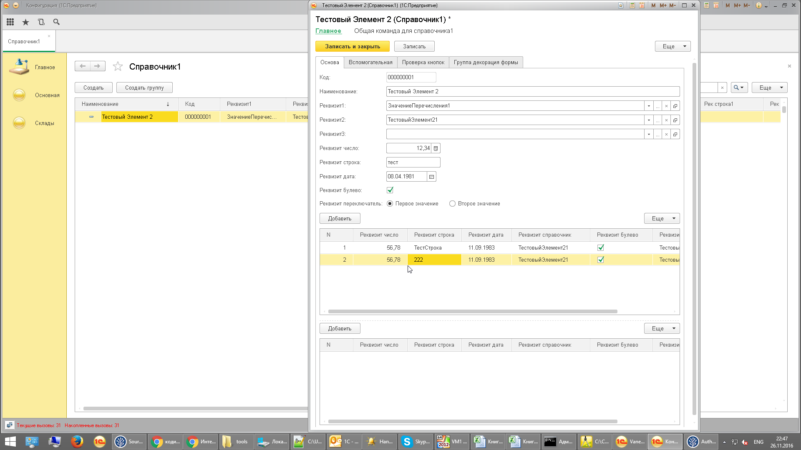
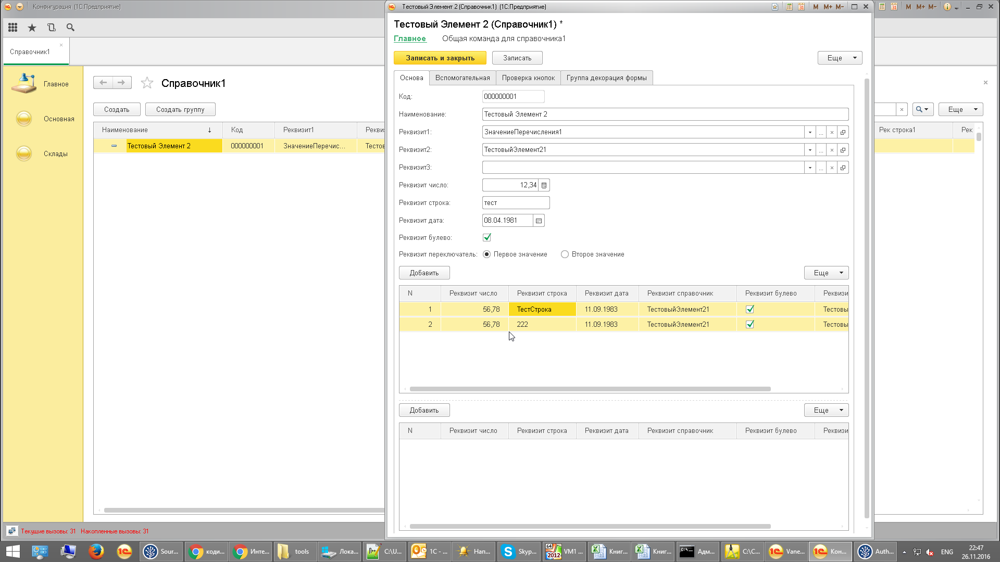
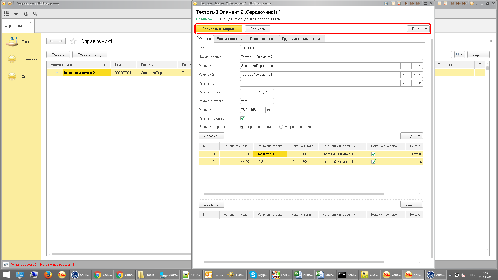

**Функционал:** Проверка редактирования поля ТЧ

> **Как** разработчик

> **Я хочу** чтобы поля ТЧ редактировались корректно

> **Чтобы** генератор фич из воздуха создавал корректный текст Gherkin

**Сценарий:** Проверка изменения реквизита ТЧ

	001. Когда я удаляю все элементы Справочника "Справочник1"

	002. Когда я создаю fixtures по макету "Макет"

	003. Когда В панели разделов я выбираю "Основная"

	004. И     В панели функций я выбираю "Справочник1"

	005. И     открылось окно "Справочник1"

	006. И     В форме "Справочник1" в ТЧ "Список" я выбираю текущую строку

	007. Тогда открылось окно "Тестовый Элемент * (Справочник1)"

	008. И     В форме "Тестовый Элемент * (Справочник1)" в таблице "ТабличнаяЧасть1" я перехожу к строке:
	| 'N' | 'Реквизит число' | 'Реквизит строка' | 'Реквизит дата' | 'Реквизит справочник выбор из формы списка' | 'Реквизит справочник' | 'Реквизит булево' |
	| '2' | '56,78'          | '111'             | '11.09.1983'    | 'ТестовыйЭлемент21'                         | 'ТестовыйЭлемент21'   | 'Да'              |

	009. И     В форме "Тестовый Элемент * (Справочник1)" в ТЧ "ТабличнаяЧасть1" я выбираю текущую строку

	010. И     В открытой форме в ТЧ "ТабличнаяЧасть1" в поле с заголовком "Реквизит строка" я ввожу текст "222"

	011. И     В форме "Тестовый Элемент * (Справочник1)" в ТЧ "ТабличнаяЧасть1" я завершаю редактирование строки

	012. Тогда таблица формы с именем "ТабличнаяЧасть1" содержит изменения:
	| 'Реквизит строка' |
	| 'ТестСтрока'      |
	| '222'             |

	013. И     В открытой форме я нажимаю на кнопку с заголовком "Записать и закрыть"

